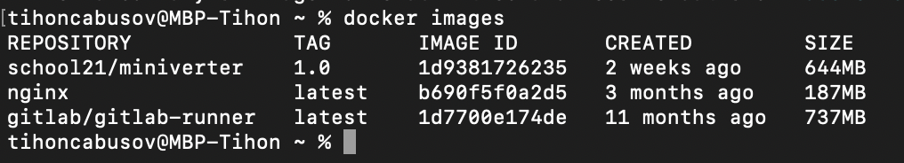
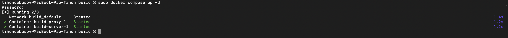

## Part 1. Ready-made docker
***

Docker у меня же уже был установлен

- Запускаю его командой `open -a docker`

- Аккаунт в Docker у меня уже был, поэтому в `Dockerhub` и нахожу официальный docker-образ с `nginx`.

- Качаю докер-образ указанной командой `docker pull nginx`

- Проверяю наличие образа через команду `docker images`

- Запускаю docker-образ через команду `docker run -d -p 80:80 [image_id|repository]`
- -d: это флаг, который указывает Docker на запуск контейнера в фоновом режиме (detached mode). Это означает, что контейнер будет работать в фоновом режиме, и командная строка будет освобождена для дальнейшего использования.
- -p: это флаг, который указывает порт моей машины и пот контейнера для доступа из вне. По-умолчанию все порты в контейнере недоступны снаружи.

- Проверяю что контейнер успешно запустился через команду `docker ps`

- Смотрю информацию о контейнере через команду `docker inspect priceless_hamilton`

- Смотрю размер контейнера `docker inspect priceless_hamilton --size | grep -i -e Size`

- Смотрю список замапленных портов командой `docker inspect priceless_hamilton --size | grep -A 2 -i -e Exposed`

- Смотрю IP контейнера командой `docker inspect -f '{{range .NetworkSettings.Networks}}{{.IPAddress}}{{end}}' priceless_hamilton`

- Останавливаю docker-образ командой `docker stop priceless_hamilton`. Проверяю, что образ успешно остановился через уже знакомую команду `docker ps`.

- Заапускаю docker-образ с портами 80:80 и 443:443 чере команду `docker run -d -p 80:80 -p 443:443 nginx`

- Проверяю, что все работает, открыв в браузере страницу по адресу localhost

- перезапускаю контейнер через команду `docker restart [container_id|container_name]` 

- Проверяю, что контейнер снова запустился командой `docker ps`

***

## Part 2. Operations with container
***

- Читаю конфигурационный файл nginx.conf внутри docker-контейнера через команду `docker exe`

- Создаю на локальной машине файл nginx.conf.

- Настраиваю в нем по пути /status отдачу страницы статуса сервера nginx.

- Копирую созданный файл nginx.conf внутрь докер-образа через команду `docker cp`

- Перезапускаю nginx внутри докер-образа через команду `docker exec romantic_carver nginx -s reload`.

- Проверяю, что по адресу localhost:80/status отдается страничка со статусом сервера nginx.

- Экспортирую контейнер в файл container.tar через команду `docker export`.

- Остановливаю контейнер.

- Удаляю образ через docker rmi [image_id|repository], не удаляя перед этим контейнеры.

- Удаляю остановленный контейнер.

- Импортирую контейнер обратно через команду `docker image import [OPTIONS] file|URL|- [REPOSITORY[:TAG]]` в моем случае `docker import -c 'cmd ["nginx", "-g", "daemon off;"]' -c 'ENTRYPOINT ["/docker-entrypoint.sh"]' container.tar nginx`.

- Запускаю импортированный контейнер командой `docker run -d -p 80:80 -p 443:443 nginx`.

- Проверяю, что по адресу localhost:80/status отдается страничка со статусом сервера nginx.

***

## Part 3. Mini web server
***

- Пишу мини-сервер на C и FastCgi, который будет возвращать простейшую страничку с надписью Hello World!.
- Чтобы это сделать необходимо создать `.c` файл, в котором будет описана логика сервера (в этом случае - вывод сообщения Hello World!), а также конфиг `nginx.conf`, который будет проксировать все запросы с порта 81 на порт 127.0.0.1:8080

- Запускаю написанный мини-сервер через spawn-fcgi на порту 8080.

    - Для этого выкачаем новый docker-образ и на его основе запустим новый контейнер

    
    
    - Копирую файл конфига и логику сервера в новый контейнер 

    

    - Установлю требуемые утилиты для запуска мини веб-сервера на FastCGI, в частности spawn-fcgi и libfcgi-dev

    

    - Компилирую командо  `gcc -I/usr/local/include server.c -lfcgi -o server` и запускаю мини веб-сервер через команду `spawn-fcgi` на порту 8080

    

    - Делаю рестарт nginx

    

- Проверяю, что в браузере по localhost:81 отдается написанная мной страничка.

***

## Part 4. Your own docker

***

### Пишу свой докер-образ, который:
  
#### собирает исходники мини сервера на FastCgi из [Части 3](#part-3-mini-web-server);

- Файлы после наполнения

  

  

  

- Собираю написанный docker-образ через команду `docker build`, при этом указав имя и тэг контейнера

[//]: # (  ![images]&#40;screenshots/Part_4/4.png&#41;)
  

- Проверяю что все собралось, проверив наличие соответствующего образа командой `docker images`
  
  

-  Запускаю собранный docker-образ с мапингом порта 81 на порт 80 локальной машины, а также мапингом папки ./nginx внутрь контейнера по адресу конфигурационных файлов nginx'а, и проверю, что страничка написанного сервера по адресу

  

- В в файле `nginx.conf` уже прописано проксирование странички `/status`, по которой необходимо отдавать статус сервера `nginx`

  

- Проверяю, что по localhost:80 доступна страничка написанного мини сервера.

  

***

## Part 5. Dockle

***

- Перед выполнением данного шага необходимо установить утилиту dockle, [инструкция по установке](https://github.com/goodwithtech/dockle), если машина [не видит утилиту ](https://github.com/aquasecurity/trivy/issues/2432), также рекомендую добавить своего пользователя в группу docker.
  

- Устанавливаю утилиту командой `brew install goodwithtech/r/dockle`

    

- Пытался запустить dockle, но столкнулся с ошибками при запуске. Исправляю командой `docker run --rm -v /var/run/docker.sock:/var/run/docker.sock goodwithtech/dockle:v0.3.1 dockle-ci-audit:$CIRCLE_SHA1`  

- Сканирую образ из предыдущего задания через `dockle [image_id|repository]`

  

- Исправлю конфигурационные файлы docker-образа так, чтобы при проверке через утилиту dockle не возникало ошибок и предупреждений

  

***

## Part 6. Basic **Docker Compose**

***

- Перед выполнением данного шага необходимо установить утилиту `docker-compose`, [инструкция по установке](https://www.digitalocean.com/community/tutorials/how-to-install-and-use-docker-compose-on-ubuntu-20-04)  
  

- У меня она уже была установлена

  

- Остановливаю все запущенные контейнеры командой `docker stop`

    

- Изменяю конфигурационные файлы (их можно найти в папке Part6/build)
  
- Собераю контейнер командой `sudo docker-compose build`
  

    

- Запускаю собранный контейнер командой `docker compose up`

      
    

- Проверяю, что в браузере по localhost:80 отдается написанная мной страничка, как и ранее

    
  

- Ура!