***

## Part 1. Настройка gitlab-runner

***

`-` Поднимаю виртуальную машину Ubuntu Server 22.04 LTS

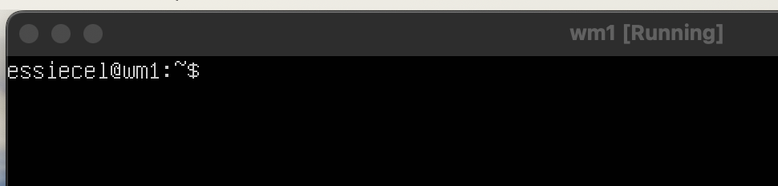

`-` Скачиваю и установливаю на виртуальную машину gitlab-runner.

Для этого:  

-   устанавливаю `curl` командой `sudo apt-get install -y curl`

    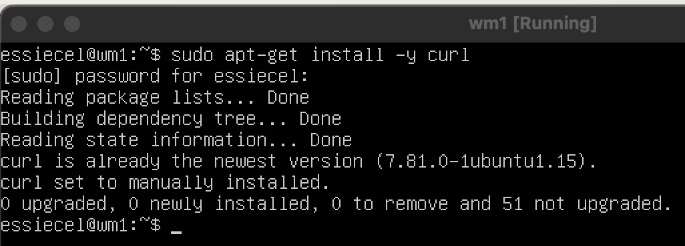

-   Скачиваю `gitlab-runner` командой `curl -L "https://packages.gitlab.com/install/repositories/runner/gitlab-runner/script.deb.sh" | sudo bash`  
  

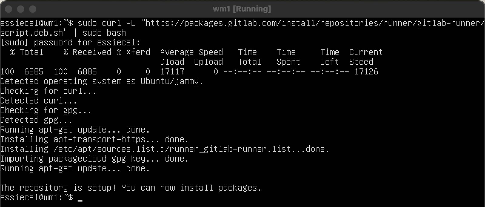  

- Проверяю наличие обновлений и устанавливаю `gitlab-runner` командой `sudo apt-get install gitlab-runner`
  
  
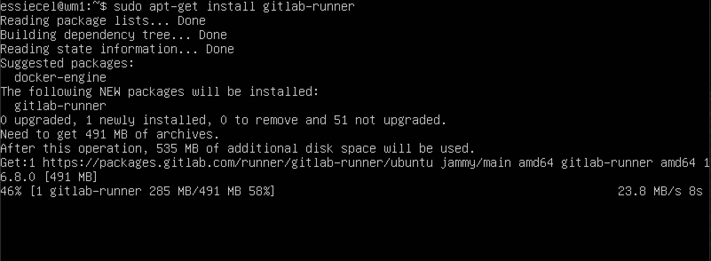  

`-` Запускаю gitlab-runner командой `sudo gitlab-runner start` 

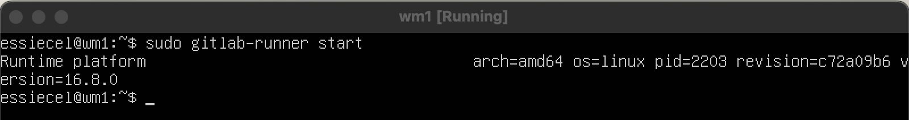

`-` Для регистрации использую команду `sudo gitlab-runner register` и беру URL и токен, которые получил на страничке задания (DO6_CICD) на платформе.

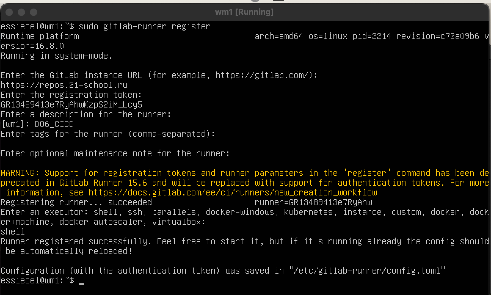

***

## Part 2. Сборка

***

`-` Пишу этап для CI по сборке приложений из проекта C2_SimpleBashUtils.

- Клонирую свой SimpleBashUtils и переношу папки с `grep` и `cat` в src - остальное удаляю за ненадобностью.

`-` Создаю в корневом каталоге файл gitlab-ci.yml  и добавляю этап запуска сборки через make-файл из проекта SimpleBashUtils.

-   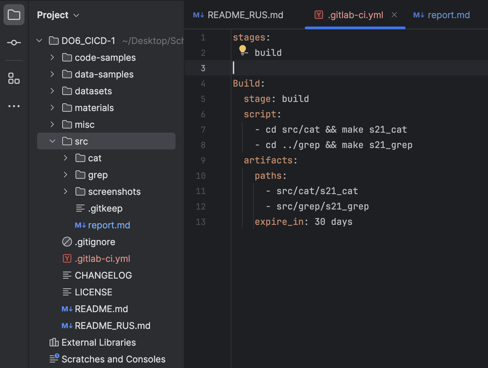

`-` Файлы, полученные после сборки (артефакты), сохраняю в произвольную директорию со сроком хранения 30 дней.

- Все успешно собралось - об этом говорит успешный Pipelines

- 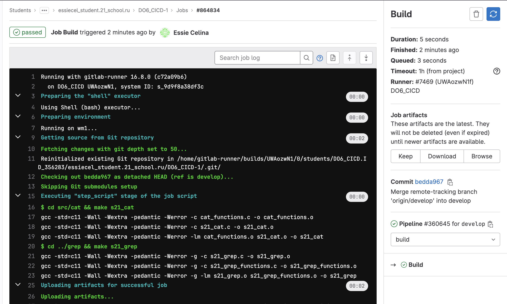

***

## Part 3. Тест кодстайла

***

`-` Пишу этап для CI, который запускает скрипт кодстайла (clang-format).

`-` Если кодстайл не прошел, то «фейлю» пайплайн.

- 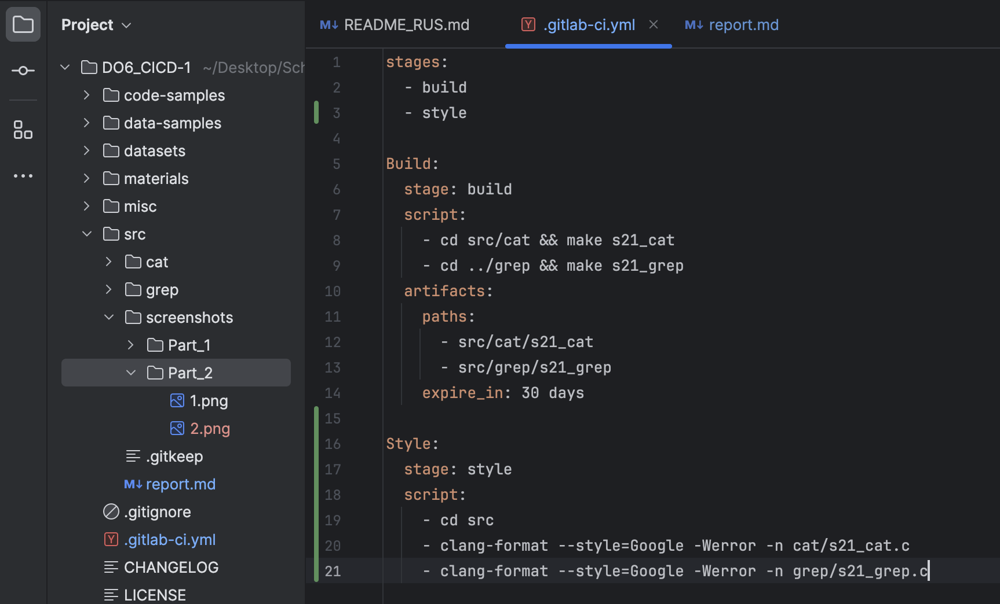

`-` В пайплайне отображаю вывод утилиты clang-format.

- 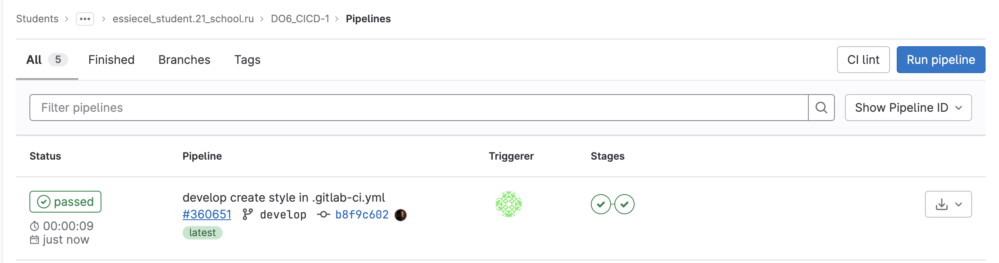
- 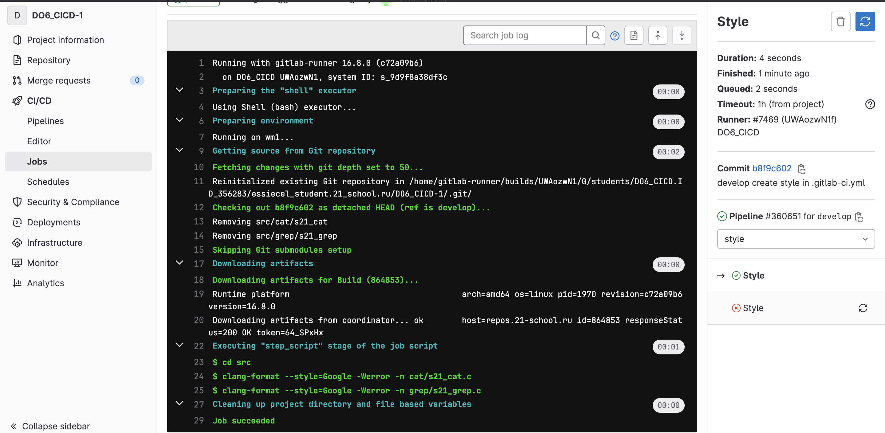

***

## Part 4. Интеграционные тесты

***

`-` Пишу этап для CI, который запускает мои интеграционные тесты из этого же проекта.

- 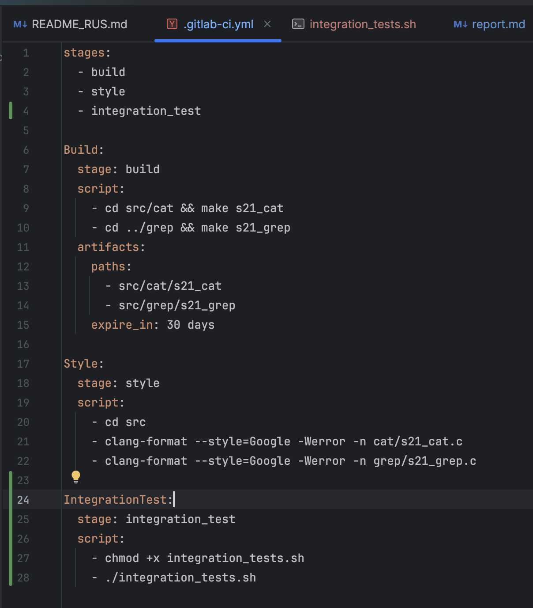

`-` Запущу этот этап автоматически только при условии, если сборка и тест кодстайла прошли успешно.

- 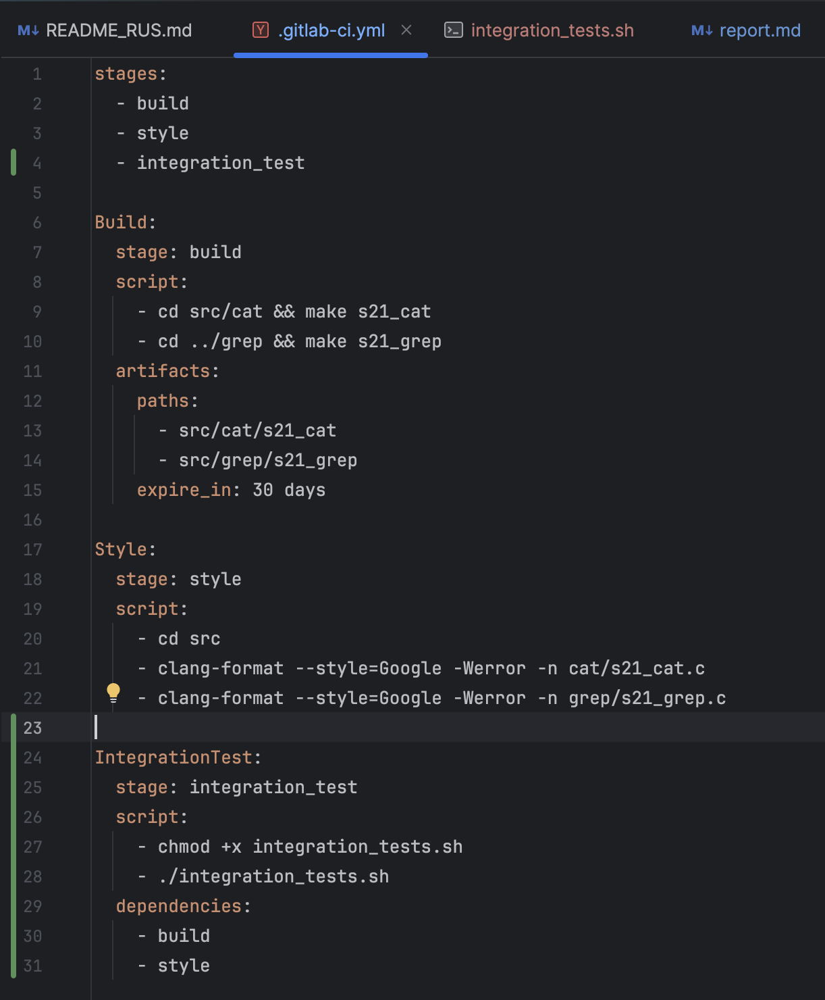

`-` Если тесты не прошли, то «фейлю» пайплайн.

- 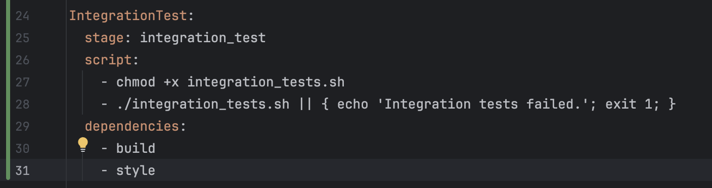

`-` В пайплайне отображаю вывод, что интеграционные тесты успешно прошли / провалились.  

- 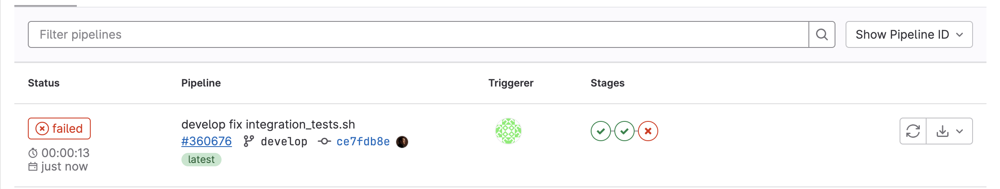
- 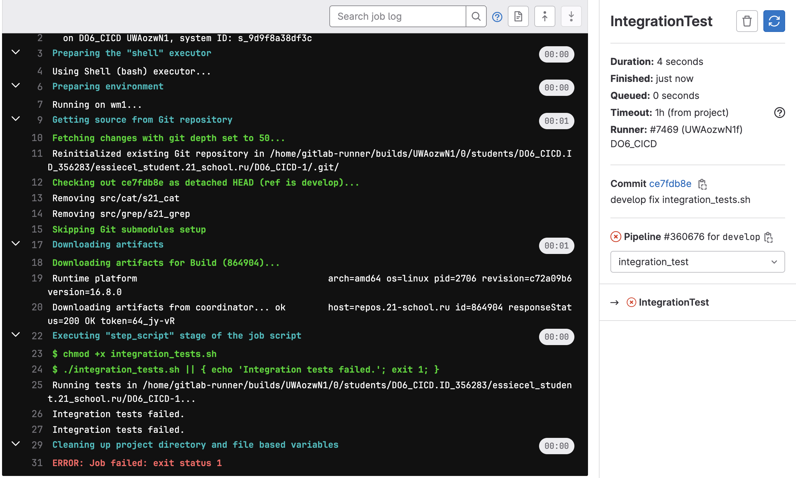

***

## Part 5. Этап деплоя

***

`-` Поднимаю вторую виртуальную машину Ubuntu Server 22.04 LTS.

- 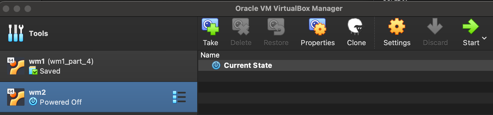

- Настраиваю связь между машинами

- 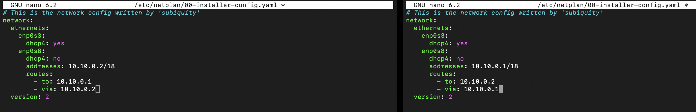

- Пингую вторую машину с первой, чтобы убедиться, что соединение есть:

- 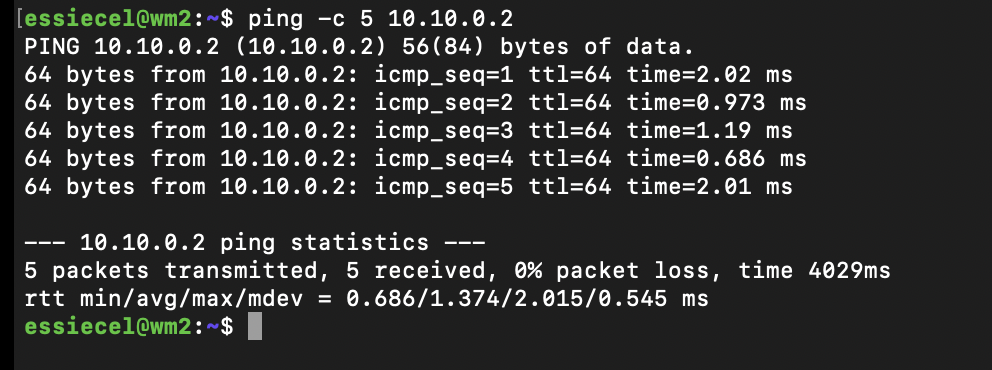

`-` Пишу этап для CD, который «разворачивает» проект на другой виртуальной машине.

- 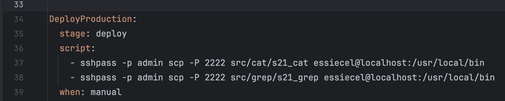  

- Проверяю что этап запуска "ручной"

- 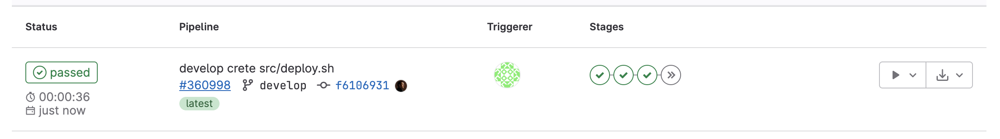

`-` Запускаю этот этап вручную при условии, что все предыдущие этапы прошли успешно.

- 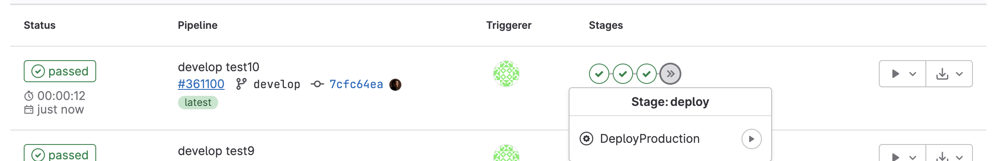

`-` Пишу bash-скрипт, который при помощи ssh и scp копирует файлы, полученные после сборки (артефакты), в директорию /usr/local/bin второй виртуальной машины.

- 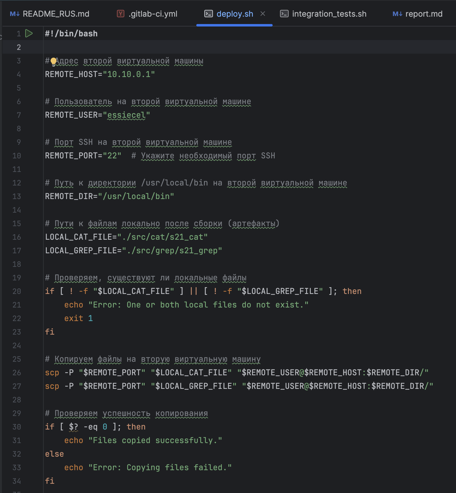

- скрипт использует команду `scp (Secure Copy Protocol)` для копирования файла с одной машины на другую по протоколу SSH (Secure Shell). 

    - scp: Это команда для копирования файлов.

    - `-P "$REMOTE_PORT"`: Опция -P используется для указания порта SSH на удаленной машине. 
    - `$REMOTE_PORT` - это переменная, которая содержит номер порта для подключения к удаленной машине.

    - `"$LOCAL_CAT_FILE"`: Это путь к локальному файлу, который я хочу скопировать. 
    - `$LOCAL_CAT_FILE` - это переменная, содержащая путь к локальному файлу.

    - `"$REMOTE_USER@$REMOTE_HOST:$REMOTE_DIR/"`: Это адрес удаленной машины и место, куда я хочу скопировать файл. 
    - `$REMOTE_USER` - это переменная, содержащая имя пользователя для подключения, 
    - `$REMOTE_HOST` - это переменная, содержащая IP-адрес или доменное имя удаленной машины
    - `$REMOTE_DIR/` - это переменная, содержащая путь к удаленной директории, куда я хочу скопировать файл.

    - Таким образом, вся команда scp копирует локальный файл $LOCAL_CAT_FILE на удаленную машину по SSH, используя указанный порт, имя пользователя, хост и путь на удаленной машине.

`-` В файле gitlab-ci.yml добавляю этап запуска написанного скрипта.

- 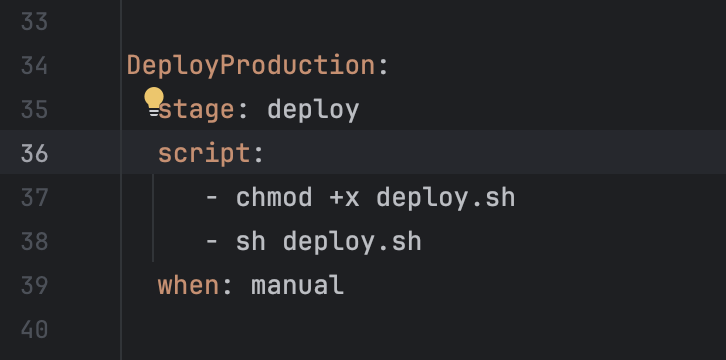

`-` В результате получаю готовые к работе приложения из проекта C2_SimpleBashUtils (s21_cat и s21_grep) на второй виртуальной машине.

`-` Сохраняю дампы образов виртуальных машин.

- 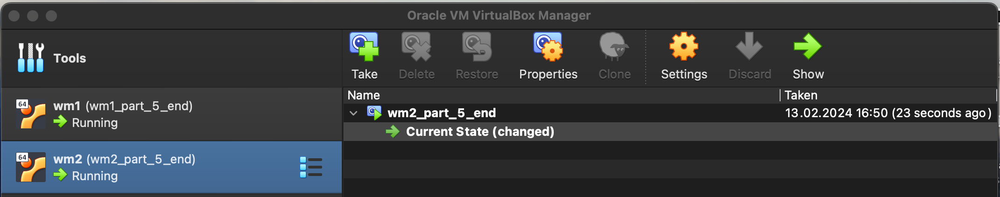

***

## Part 6. Дополнительно. Уведомления

***

`-` Настроить уведомления о успешном/неуспешном выполнении пайплайна через бота с именем «[мой nickname] DO6 CI/CD» в Telegram.
- Необходимо получить токен бота. Для этого использую инфраструктуру телеграма, а точнее главного бота "BotFather". Выполняю команды указаные ниже и получаем токен.

- 

- Проверка что бот отвечает `https://api.telegram.org/bot<YOUR_BOT_TOKEN>/getMe`

- 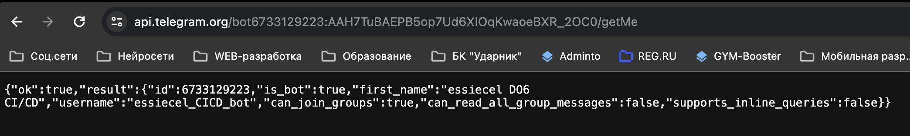

- Необходимо получить id чата. Для этого пишу любое сообщение боту и после в адресной строке браузера ввожу `https://api.telegram.org/bot<YOUR_BOT_TOKEN>/getUpdates`

- 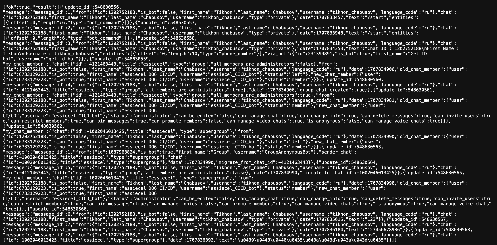

- В самом низу видим id со знаком `-`

- Пишу bash-скрипт для отправки сообщений в который прописываю токен бота и id чата (так делать НЕЛЬЗЯ все важные данные, логины, пароли, должны быть в виртуальном окружении, но для учебных целей пусть будет)

- 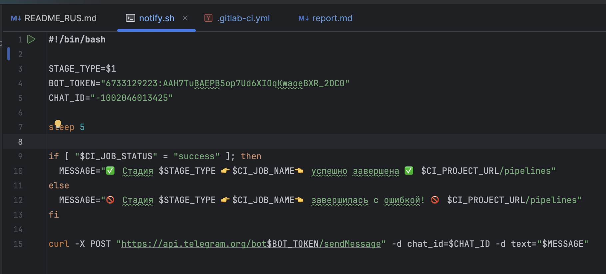

- Добавляю вызов скрипта для каждой цели 

- 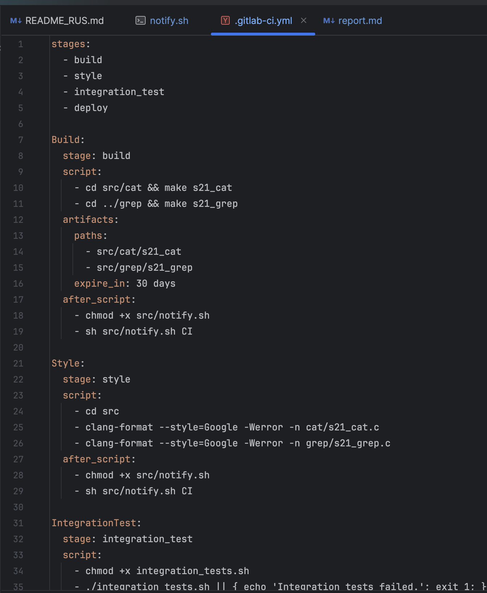

- Текст уведомления содержит информацию об успешности прохождения как этапа CI, так и этапа CD.
- В остальном текст уведомления произволен.

- 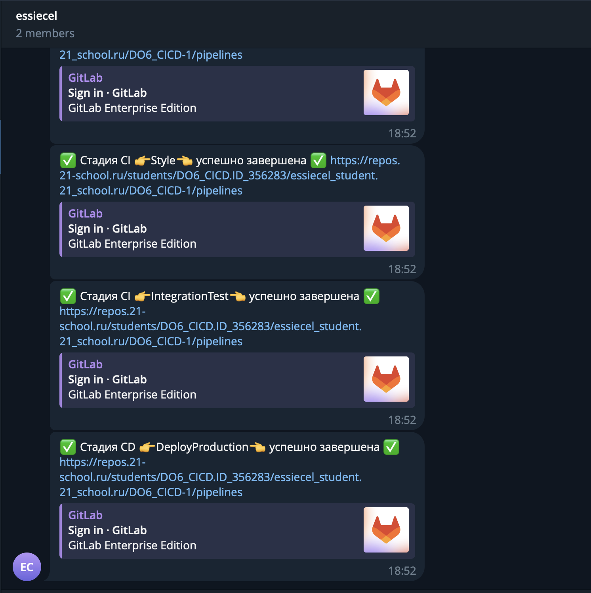

- Конец